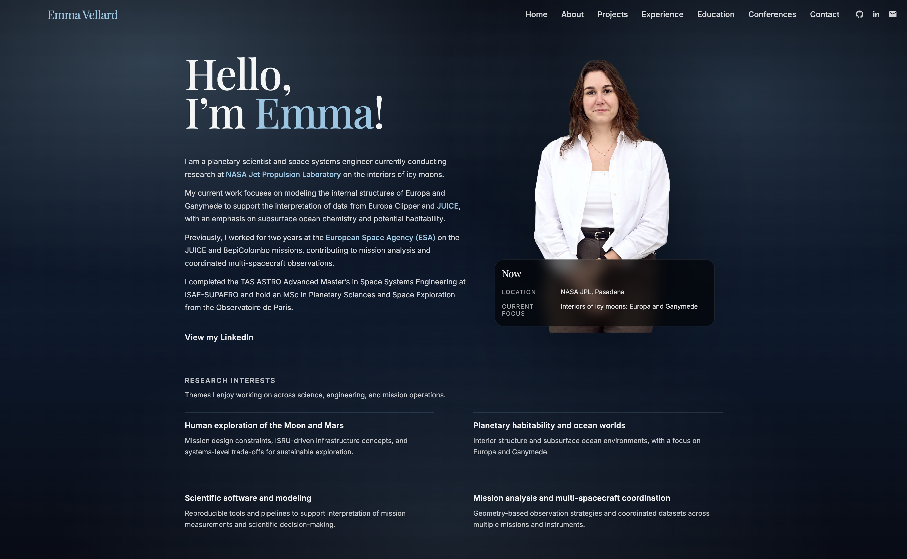

# 🌌 Emma Vellard — Portfolio

Personal portfolio website built with **Astro** and deployed on **Vercel**.

This website presents my work in:

- Planetary science,
- Multi-spacecraft geometry,
- Scientific software development,
- Mission-oriented research (ESA, NASA JPL, academia)

---

## 🖼 Preview

  
  

---

## 🚀 Tech Stack

- Astro
- CSS (custom design system)
- Vercel (deployment, analytics, speed insights)

---

## 📂 Structure

- `/projects` — Research and software projects (SolarConflux, Phobos & Deimos, DIPLONA etc.)
- `/experience` — Professional and research experience
- `/education` — Academic background and certifications
- `/conferences` — Talks and presentations
- `/contact` — Contact and availability

---

## 🌍 Deployment

The site is deployed on Vercel:  
🔗 [www.emmavellard.com](https://www.emmavellard.com)

---

## 📄 License

This project is for personal portfolio use.
Content and design © Emma Vellard.