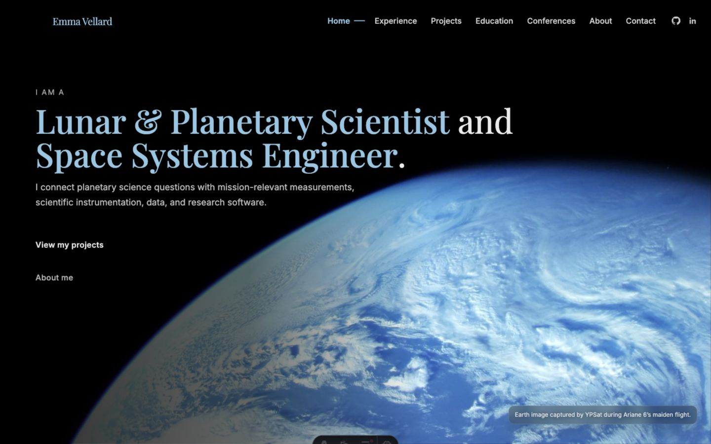
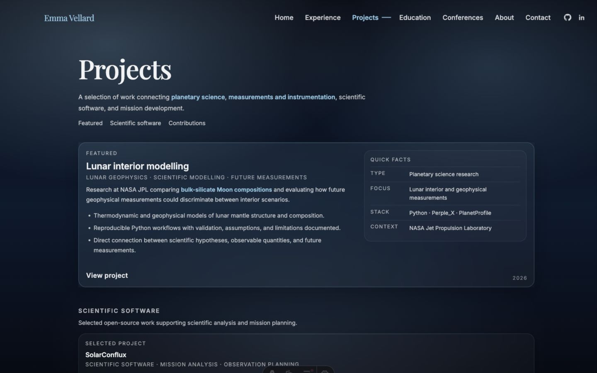

<h1 align="center">🌌 Emma Vellard — Planetary Science Portfolio</h1>

<p align="center">
  Portfolio of a planetary scientist and space systems engineer working across lunar science, scientific instrumentation, mission research, and scientific software.
</p>

<p align="center">
  <a href="https://www.emmavellard.com"><strong>Visit the live portfolio</strong></a>
</p>

## Preview

<p align="center">
  
  
</p>

## Scientific focus

- Lunar interiors, geophysics, and bulk-silicate Moon composition scenarios
- Scientific instrumentation concepts, measurement performance, and mission science
- Planetary spectroscopy, surface and subsurface processes
- Observation planning and scientific data workflows for ESA and NASA missions
- Reproducible Python tools for planetary modelling and mission analysis

## Featured work

- **Lunar interior modelling** — thermodynamic and geophysical research at NASA JPL
- **Planetary EOS Lab** — reproducible Perple_X workflows for planetary interior models
- **SolarConflux** — multi-spacecraft geometry and coordinated observation planning
- **DIPLONA** — preliminary radar sounder and payload concept for Ceres
- **Phobos & Deimos** — spectral analysis and FTIR studies in the MMX mission context
- **Lunar Spaceport** — sustainable lunar infrastructure, ISRU, and systems study

## Site sections

- `/experience` — research, mission, and engineering experience
- `/projects` — scientific research, open-source software, and mission studies
- `/education` — academic background and certifications
- `/conferences` — talks, posters, and submitted research
- `/about` — profile, skills, and languages
- `/contact` — contact details and downloadable CV

## Technology

- [Astro](https://astro.build/) with static site generation
- Custom responsive CSS and accessible navigation
- Vercel Analytics and Speed Insights
- Open Graph metadata, sitemap, and search-engine indexing support

## Local development

Use Node.js 22.12 or newer (the repository includes an `.nvmrc` file).

```sh
npm install
npm run dev
```

Create a production build with:

```sh
npm run build
```

Run the full local quality suite with:

```sh
npx playwright install chromium
npm run quality
```

The quality suite checks formatting and Astro types, validates the generated pages and internal links, and runs browser interaction tests.

## Deployment

The portfolio is deployed on Vercel at [www.emmavellard.com](https://www.emmavellard.com).

## License

This repository is for personal portfolio use. Content and design © Emma Vellard.
